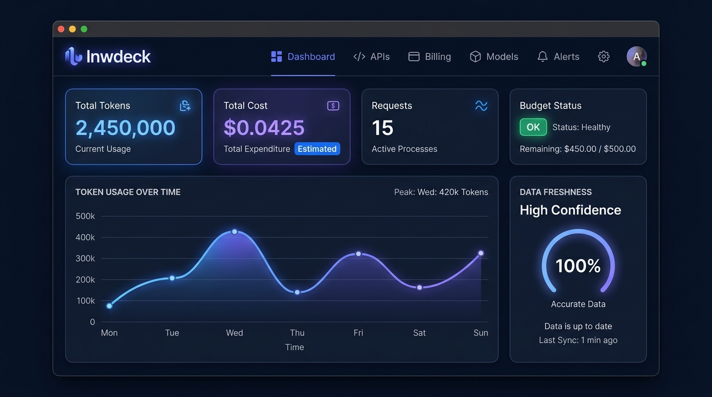
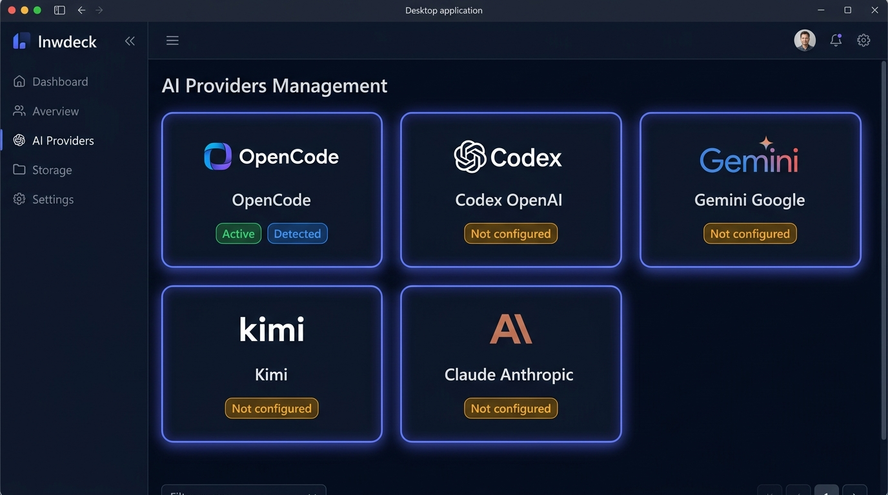
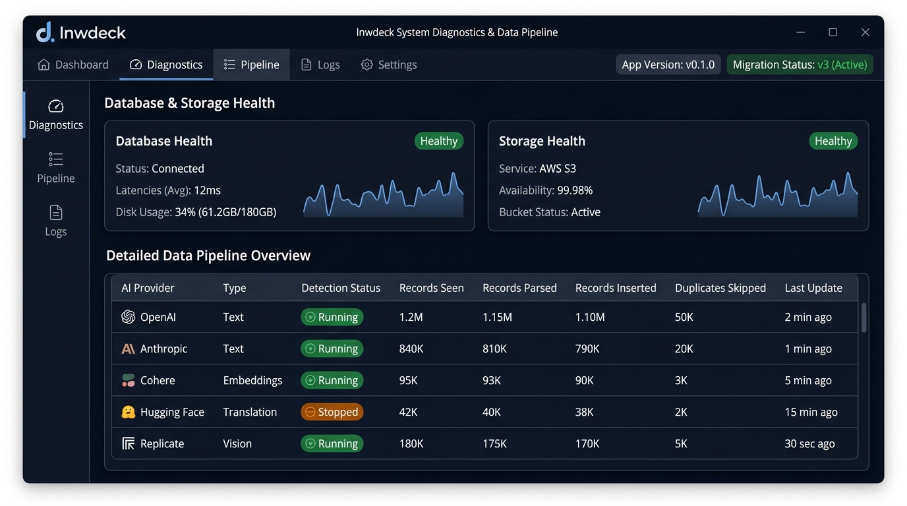

# lnwdeck

> **Universal AI Usage & Cost Tracker for Windows**  
> Aggregate tokens, costs, quotas, and engine health across your local AI tools and providers in a single, privacy-first local dashboard.

[](LICENSE)
[](https://github.com/engasnm111/lnwdeck)
[](https://github.com/engasnm111/lnwdeck)

---

## 📸 Screenshots

### Overview Dashboard


### Providers Management (Codex, Gemini, Kimi, Claude, OpenCode & more)


### System Diagnostics & Data Pipeline Health


---

## 🌟 Key Features

- **🔒 100% Privacy-First & Metadata-Only**: Runs entirely locally on your machine with zero cloud server requirements. **lnwdeck** collects token and cost metadata—**never** your prompts, code snippets, AI responses, or private file paths.
- **💰 Dynamic Cost Calculation**: Calculates accurate and estimated AI costs across model families with pricing catalog support and fallback labels.
- **🔌 Multi-Engine AI Adapters**: Detects and aggregates usage across 10 built-in AI engine adapters:
  - **Codex (OpenAI)**
  - **Gemini (Google)**
  - **Kimi (Moonshot)**
  - **Claude (Anthropic)**
  - **OpenCode**
  - **GitHub Copilot**
  - **Cursor**
  - **Grok (xAI)**
  - **Ollama** (Local LLMs)
  - **OpenRouter**
- **💻 Desktop AppShell & System Tray**: Full dark-theme desktop application with system tray integration and customizable floating widget.
- **⚙️ Data Pipeline Diagnostics**: Comprehensive diagnostics page for database integrity, migration status, records parsed, inserted, duplicates skipped, and sanitized JSON exports.

---

## 🛠️ Quickstart

### Prerequisites

- **Windows 10 22H2+** or **Windows 11**
- **Node.js 22+** with `pnpm`
- **Rust 1.77+** (`stable-x86_64-pc-windows-msvc`)

### Setup & Run

```powershell
# Clone repository
git clone https://github.com/engasnm111/lnwdeck.git
cd lnwdeck

# Install dependencies
pnpm install

# Run workspace quality checks (cargo fmt, cargo clippy, pnpm typecheck)
pnpm check

# Execute full test suite (Rust unit/integration + TypeScript Vitest + E2E)
pnpm test

# Launch application in dev mode with hot reload
pnpm tauri:dev
```

### Build Executable

```powershell
# Build release binaries
pnpm tauri:build

# Create portable bundle
pwsh ./scripts/package-portable.ps1
```

---

## 🔒 Security & Privacy Guarantees

1. **Local Storage Only**: All metrics and adapter states are stored in an encrypted/local SQLite database on your machine.
2. **Strict Redaction**: Log parsers automatically redact credentials, API tokens, authorization headers, and absolute personal file paths.
3. **Deny-by-Default Policy**: Community adapters run in isolated sandboxes with explicit user consent required for file or network access.

---

## 📄 License

**lnwdeck** is open-source software licensed under the [MIT License](LICENSE).
