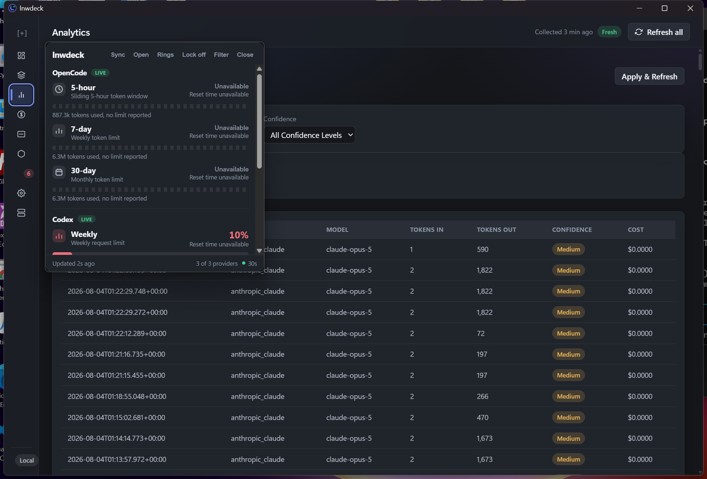
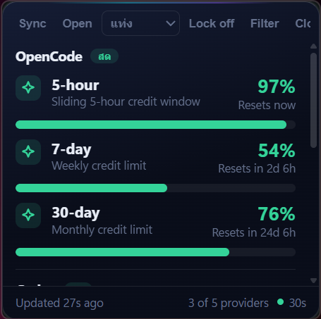
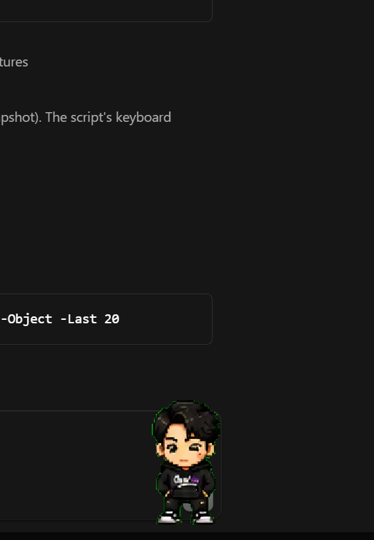

# lnwdeck v10.0.0

Universal AI usage and quota tracker for Windows. lnwdeck reads the local
artifacts already written by AI tools, records token counts and costs, and
shows provider-reported quota. It is local-only: no account, server or cloud
sync is required.

[](LICENSE)
[](https://github.com/engasnm111/lnwdeck)
[](https://github.com/engasnm111/lnwdeck)

## What it does

- Records local usage history: requests, input/output tokens, models and
  timestamps. Scans are read-only and bounded.
- Separates provider-reported quota from usage history. Missing provider limits
  are shown as usage-only data, never as an invented percentage.
- Calculates costs from the bundled local pricing catalog, with explicit
  estimates for models that have no exact catalog match.
- Provides budgets, alerts, diagnostics and sanitized JSON export.
- Includes a floating quota widget and a transparent desktop pet, both using
  the same live provider data as the dashboard.

## v10.0.0 dashboard

The Overview page is a local TokenTracker-style analytics dashboard. It combines
usage from every detected AI/provider without dropping partial results and
supports **Day**, **Week**, **Month**, **Year**, **Total** and **Custom** ranges.
Custom ranges use the user's local calendar as `[start, end)` and convert the
bounds to UTC before querying. Provider filters apply to the full result.

The page shows total/input/output tokens, duration, session count, provider cards
for **All** and each provider, a usage-trend chart, an activity heatmap and a
session table with one row per session plus provider breakdown. Selecting a
provider icon filters the complete dashboard; selecting **All** restores the
combined view.

### Token formatting

One shared formatter is used by Dashboard, Widget, Pet, Tray and ARIA labels:

- Compact values use uppercase `K/M/B/T`: `1.2K`, `3.5M`, `1.2B`, `10.2T`.
- Unnecessary `.0` decimals are removed (`1M`, not `1.0M`).
- Full values use ASCII comma grouping from 1,000 in every locale:
  `1,000`, `1,234,567`, `1,234,567,890`.
- Compact values are keyboard-accessible buttons. Click or press Enter/Space to
  show the full comma-grouped value; Escape returns to compact form.

### Pets and official Codex Pets import

The Pet page has explicit Add/Import controls and starts with eight bundled
defaults:

`youyou`, `old-bai`, `a-ti`, `sharkler`, `solaire`, `tennis-ball`,
`friend-pixel-pet`, `yae-miko`.

The v10 migration adds missing new defaults without restoring custom pets or
defaults that the user deliberately deleted. Pet management is kept on the Pet
page; Settings only contains widget settings.

Imports accept only an exact HTTPS `codex-pets.net` URL with the official
`https://codex-pets.net/#/pets/<id>` or
`https://codex-pets.net/api/pets/<id>/download` shape. The id is validated
locally, then a canonical download URL is constructed. The user-entered URL is
never fetched directly. HTTP, ports, credentials, subdomains, lookalike domains,
extra query/path data and malformed ids are rejected.

### Widget, tray and taskbar behavior

- Bars, Rings and Pet widget modes use a themed accessible dropdown with arrow
  keys, Enter/Space, Escape, outside-click handling, visible focus and reduced
  motion support. Native selects have a dark `color-scheme` fallback.
- Main, Widget, Pet and the localized tray popup are separate windows. Widget,
  Pet and Tray use `skip_taskbar`; Main is the only dashboard taskbar window.
  Closing Main hides it to the tray. Opening only a pet/widget therefore does
  not create a misleading main-app taskbar button.
- Left-clicking the native tray icon opens the popup beside the icon. The popup
  has localized metrics, compact/full token values and an Open dashboard action.
  The native tray menu and its `Sync now ({time})` label use the selected locale.
- Main UI, Widget, Pet, Tray popup, native tray, notifications, tooltips,
  placeholders, loading/empty/error states and ARIA labels are translated in
  English, Thai, Simplified Chinese, Japanese, Korean, German, French, Spanish
  and Russian. Language changes update open surfaces immediately.

### Background refresh and notifications

Refresh All is one shared background job for Main, Widget, System and Tray. It
coalesces repeated clicks, emits started/progress/completed/partial/failed
events, keeps the UI interactive, applies provider results incrementally and
preserves last-known data when a provider fails. Mark all as read uses an
optimistic UI with transactional rollback on failure.

## Provider support

Built-in adapters currently cover Claude, Codex, OpenCode, Gemini, Cursor,
Copilot, Kiro, ZCode, Z.AI (GLM), Kimi Code, Kilo CLI, Kilo Code, Mimo Code,
Roo Code, CodeBuddy, WorkBuddy, pi, oh-my-pi, Hermes, Ollama, OpenRouter and
Grok. Each adapter declares its supported usage/quota channels. Unsupported or
missing sources are reported honestly rather than recorded as successful empty
collections.

Credential-backed providers use Windows Credential Manager or the provider's
own locally stored credential. Nothing is sent before the user explicitly
configures a provider that requires a key.

## Screenshots

Screenshots are captured from the built Windows application and therefore show
real local data:

| View | Image |
|---|---|
| Dashboard |  |
| Providers |  |
| Costs |  |
| System diagnostics |  |
| Floating widget |  |
| Desktop pet |  |

Recapture them with `pwsh ./scripts/capture_app_screenshots.ps1 -ShowWidget`
after a release build.

## Languages and design

The nine supported languages are English, Thai, Simplified Chinese, Japanese,
Korean, German, French, Spanish and Russian. The selected language is stored in
local settings and is applied immediately to Main, Widget, Pet, Tray and native
tray labels.

The UI follows the Premium Dark Futuristic Glassmorphism system in
[docs/DESIGN.md](docs/DESIGN.md): near-black navy canvas, glass panels, cyan /
blue / violet accents, keyboard-visible focus and reduced-motion support. Dark
is the default theme; light mirrors the same component tokens.

## Quickstart

Requirements: Windows 10 22H2 or Windows 11, WebView2 Runtime, Node.js 24 with
pnpm, and Rust stable for `x86_64-pc-windows-msvc`.

```powershell
git clone https://github.com/engasnm111/lnwdeck.git
cd lnwdeck
pnpm install

# formatting, clippy with warnings denied, typecheck and project checks
pnpm check

# Rust, React/Vitest and release-script tests
pnpm test

# compiled pipeline E2E tests
pnpm test:e2e

# development desktop app with hot reload
pnpm tauri:dev
```

## Building and verifying v10.0.0

Signed installers and updater artifacts require the Tauri signing key:

```powershell
$env:TAURI_SIGNING_PRIVATE_KEY = Get-Content keys/lnwdeck.key -Raw
$env:TAURI_SIGNING_PRIVATE_KEY_PASSWORD = ""
pnpm tauri:build

# Package one target as x64, arm64 or x86 portable ZIP
pwsh ./scripts/package-portable.ps1 -Arch x64

# Build the updater manifest from signed installers
node scripts/generate-updater-json.mjs v10.0.0 <assets-dir> <assets-dir>/latest.json

# Verify versions, release fixtures, signatures/manifest contract and metadata
node scripts/check-release-version.mjs v10.0.0
pnpm release:test
```

The release workflow builds x64, ARM64 and x86 installers and portable ZIPs.
Each installer and portable ZIP has a `.sig`; the published assets also include
`latest.json`, `SHA256SUMS`, a CycloneDX SBOM and GitHub build provenance. The
complete release checklist and rollback procedure are in
[docs/releases/v10.0.0.md](docs/releases/v10.0.0.md).

## Privacy

- Local sources are read-only and bounded by file-count and byte limits.
- Only numeric token counts, timestamps, model identifiers, quota values and
  user-entered display metadata are stored. Prompts, responses, source code,
  file contents, file names, absolute paths and secrets are not stored.
- Provider API keys are stored in Windows Credential Manager, never in SQLite,
  logs, UI state or exports.
- Network requests are limited to declared provider endpoints and the explicit
  official Codex Pets import. No arbitrary user-entered pet URL is fetched.
- The local SQLite database is not encrypted at rest.

## Known limitations

- Installers carry updater signatures but are not Authenticode-signed, so
  Windows SmartScreen may warn on first run.
- Refresh cancellation is cooperative between synchronous provider collectors;
  the shared job has a bounded 60-second deadline, and a provider call already
  inside I/O cannot be force-killed safely. Previously stored data remains
  visible during partial refresh.
- OpenCode usage events are cumulative session snapshots; per-update delta
  accounting is not implemented.
- The browser extension must be loaded manually in Chromium Developer mode.

## Credits

- [TokenTracker](https://github.com/xiufengsun/TokenTracker) for dashboard and
  community pet UX references.
- [codex-pets.net](https://codex-pets.net) for the official pet catalog and
  bundled pet package format.
- [Tauri](https://tauri.app), Rust and the open-source provider communities.

## License

MIT. See [LICENSE](LICENSE).
